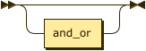
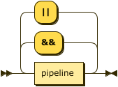
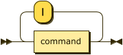
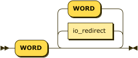
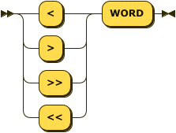
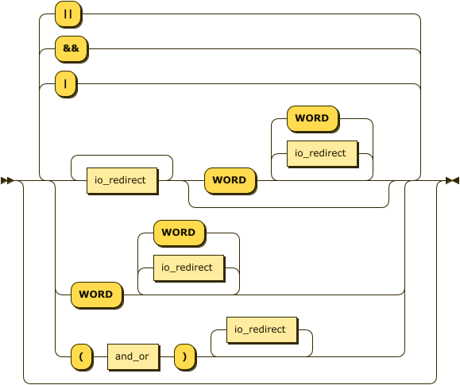

# program



```
program  ::= and_or?
```

# and_or



```
and_or   ::= pipeline ( ( '&&' | '||' ) pipeline )*
```

referenced by:

* [command](#command)
* [program](#program)

# pipeline



```
pipeline ::= command ( '|' command )*
```

referenced by:

* [and_or](#and_or)

# command


```
command  ::= io_redirect+ phrase?
           | phrase
           | '(' and_or ')' io_redirect*
```

referenced by:

* [pipeline](#pipeline)

# phrase



```
phrase   ::= 'WORD' ( io_redirect | 'WORD' )*
```

referenced by:

* [command](#command)

# io_redirect



```
io_redirect
         ::= ( '<' | '>' | '>>' | '<<' ) 'WORD'
```

referenced by:

* [command](#command)
* [phrase](#phrase)

# program_extended



```
program_extended
         ::= ( ( io_redirect+ ( 'WORD' ( io_redirect | 'WORD' )* )? | 'WORD' ( io_redirect | 'WORD' )* | '(' and_or ')' io_redirect* ) ( ( '|' | '&&' | '||' ) ( io_redirect+ ( 'WORD' ( io_redirect | 'WORD' )* )? | 'WORD' ( io_redirect | 'WORD' )* | '(' and_or ')' io_redirect* ) )* )?
```

# Raw data
<details><summary>code</summary>
<div>

```
program ::= and_or?

and_or ::= ( pipeline ( ( '&&' | '||' ) pipeline )* )

pipeline ::= ( command ( '|' command )* )

command ::=
(
    io_redirect+
    phrase?
    | phrase
    | ( '(' and_or ')' ) io_redirect+?
)

phrase ::= ( 'WORD' ( io_redirect | 'WORD' )* )

io_redirect ::= ( ( '<' | '>' | '>>' | '<<' ) 'WORD' )

program_extended ::=
(
    (
        io_redirect+
        ( 'WORD' ( io_redirect | 'WORD' )* )?
        | ( 'WORD' ( io_redirect | 'WORD' )* )
        | '(' and_or ')' io_redirect*
    )
    (
        ( '|' | '&&' | '||' )
        (
            io_redirect+
            ( 'WORD' ( io_redirect | 'WORD' )* )?
            |  ('WORD' ( io_redirect | 'WORD' )* )
            | '(' and_or ')' io_redirect*
        )
    )*
)?
```

</div>
</details>


# References
* [https://github.com/Wolframike/minishell/wiki/minishell-syntax-diagram](https://github.com/Wolframike/minishell/wiki/minishell-syntax-diagram)
* [https://github.com/harsssh/minishell/wiki/Railroad-Diagram](https://github.com/harsssh/minishell/wiki/Railroad-Diagram)
* [https://www.bottlecaps.de/rr/ui](https://www.bottlecaps.de/rr/ui)
* [https://pubs.opengroup.org/onlinepubs/9699919799/utilities/V3_chap02.html#tag_18_10](https://pubs.opengroup.org/onlinepubs/9699919799/utilities/V3_chap02.html#tag_18_10)
